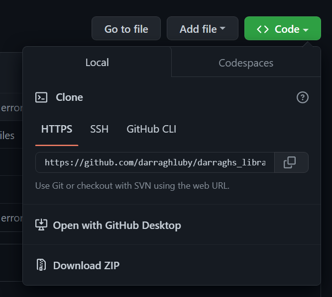

# Darragh's Library
Darragh's Library is a Python module containing various functions, classes, etc. It contains bundles of code that can be used repeatedly in many different programs, and it makes working with Python simpler and more efficient.

### Installation
I am currently working on uploading this library to PyPi.
If you want to, you can download the files now:

1. Navigate to the top right of this repository
2. You should see a green `<> Code` button
3. Click on it, and go to the "Local" section
4. Click `Download ZIP`

From here, you can extract the main folder ("darraghs_library"),
and to import the module into your own new Python file, create that file in the same folder.

### Using the module
There are lots of functions and classes available that you may find useful.
For full details on how to use them, use the helpme function:
`helpme()`